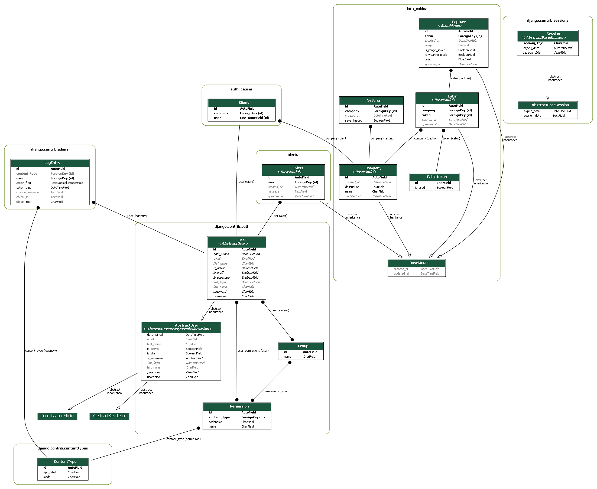

# ApiCabina
API for managing a biosecurity system

### API Description

- POST [username,password]  /api/auth/login/  --> Login with credentials. Perm: (any).
- GET /api/auth/logout/  --> Logout from current session. Perm: (auth).
- GET /api/auth/ --> Get all system's users. Perm: (super user).
- GET /api/auth/user_id/ --> Get user info. Perm: (super user).
- GET /api/data/company --> Get all system's companies. Perm: (super user).
- GET /api/data/company/company_id/ --> Get companies info. Perm: (super user).
- GET /api/data/company_data/ --> Get company info from current user. Perm: (auth).
- GET /api/data/cabins_company/ --> Get cabins for a company. Perm: (auth).
- GET /api/data/captures_company/ --> Get captures for a company. Perm: (auth).
- GET /api/data/captures_cabin/cabin_id/ --> Get captures for a cabin. Perm: (auth).
- GET /api/data/captures --> Get all system's captures. Perm: (super user).
- GET /api/data/captures/capture_id/ --> Get capture info. Perm: (super user).
- POST [token,temp,is_wearing_mask,is_image_saved,image_base64]  /api/data/captures_create/ --> Create a capture. Perm: (any).
- POST [token]  /api/data/register_cabin/ --> Register cabin. Perm: (auth).

### Data Base Entity Relationship Diagram

### Run tests

...

### Run development server
    python manage.py runserver 80

### Seed database with test data
    python manage.py seed
Test user: test1. Password: test_password
